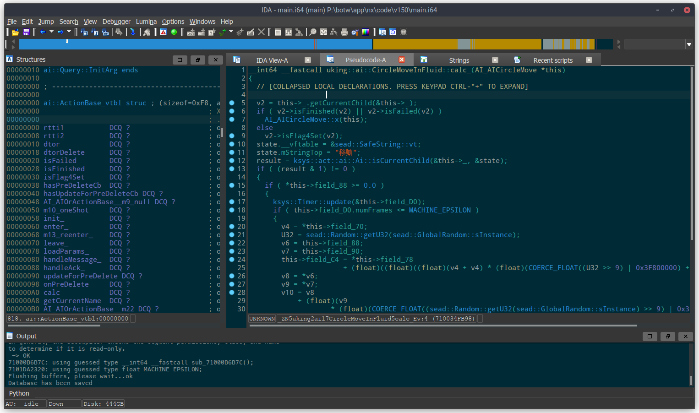

Now that the project repository is set up and your editor is ready, the last thing you need to set up is the **decompiler** tool you'll be using to reverse engineer the executable.

:::info Decompiler?
A decompiler is a program that translates assembly code into pseudocode (something that vaguely looks like source code).
:::

Pseudocode is much faster to read than assembly and can be made even more readable with some effort, so we highly recommend using a decompiler such as Hex-Rays or Ghidra.

As of 2022, IDA/Hex-Rays is still ahead of competing tools for heavy analysis of large C++ AArch64 binaries,
so we recommend acquiring a copy of IDA Pro 7.6+ if you want to contribute to this project. Having IDA will also let you use the project IDA database which simplifies the setup process.

## IDA (recommended) {#ida}

### Useful plugins {#ida-plugins}

- [LazyIDA](https://gist.github.com/leoetlino/bdac084a1fb0342b734faecf3ae49df9) to copy function addresses with a single key press (W)
- [HexRaysPyTools](https://github.com/leoetlino/HexRaysPyTools) for automatic reconstruction of structs and other useful features in the decompiler view

### Loading the database {#ida-loading}

If you have IDA 7.6+, ping a BotW project lead on the Zelda Decompilation Discord to get a copy of the IDA database (IDB) which will make decompilation easier and help with understanding the code.

### Usage {#ida-usage}

When you open the IDB, you'll see several tabs:

* **IDA View**: This is an interactive disassembly of the executable.
* **Pseudocode**: This is where you can find the pseudocode that Hex-Rays produces. Unlike other decompilers such as m2c, this output is fully interactive. You can define function signatures, variable names, types, etc. in this tab and improve the pseudocode output interactively. This is the tab you'll be working in most of the time. (If you can't find this tab or if you accidentally closed it, go to the IDA View tab, select a function and then press F5 to re-open the pseudocode tab.)
* **Strings**: A list of all valid strings in the executable. Occasionally useful for finding functions that have not been reverse engineered and named yet.
* **Structures**: A listing of all defined structures in the IDB. Useful for defining structures/fields and making the pseudocode easier to read.

#### Common keyboard shortcuts {#ida-keyboard-shortcuts}

Keyboard shortcuts are the most efficient way to navigate between functions and interact with the pseudocode. Here's a list of very useful shortcuts:

* To rename an item, click on its text and press <kbd>N</kbd>.
* To change the type of a variable (in the pseudocode) or a function, click on its text and press <kbd>Y</kbd>.
* Press <kbd>H</kbd> on a number to switch between its decimal and hexadecimal representations.
* Double click on a function or click+<kbd>Enter</kbd> to jump to that function.
* <kbd>Esc</kbd> to go back.
* <kbd>Ctrl</kbd>+<kbd>P</kbd> brings up a function chooser. Very useful for the IDA View and Pseudocode tabs.
* Use <kbd>Ctrl</kbd>+<kbd>Shift</kbd>+(<kbd>Up</kbd>/<kbd>Down</kbd>) to show the previous/next function.
* <kbd>Ctrl</kbd>+<kbd>W</kbd> saves the database.
* [Other shortcuts are mentioned here](https://www.hex-rays.com/products/ida/support/freefiles/IDA_Pro_Shortcuts.pdf).
* [If you have HexRaysPyTools] <kbd>Shift</kbd>+<kbd>L</kbd> to propagate types from a call site (invocation) to the callee function.
* [If you have LazyIDA] <kbd>W</kbd> to copy the address of the current selection (put the cursor on the first line of the pseudocode to copy the address of the current function)

### Handling C++ types and vtables in IDA (7.2+) {#ida-cpp-types}

IDA has basic support for C++ types (inheritance and vtables). If you want to create structs that represent vtables, you should follow a [specific naming convention as explained on the IDA website](https://www.hex-rays.com/products/ida/support/idadoc/1691.shtml).

Alternative: write your C++ type definitions in a header file and then [import](#import) them into IDA. This is usually much more convenient than defining types in IDA directly, especially for complex type hierarchies or templated types.

## Ghidra {#ghidra}

[Ghidra](https://ghidra-sre.org/) is an open-source software reverse engineering tool developed by the NSA.
If you cannot or do not want to use IDA, Ghidra is a decent alternative (though less ideal than IDA for RE'ing something like BotW).

Note that you will need to import names and types manually and you will not be able to make use of the existing IDA reverse engineering database if you use Ghidra, so this is really not the recommended option.

### Loading the executable {#ghidra-load}

1. Install the [Switch loader](https://github.com/Adubbz/Ghidra-Switch-Loader).
2. Open the 1.5.0 NSO. If you've run the setup script (as mentioned in the [installation guide](installation)), a copy of the NSO is stored at `data/main.nso`.
3. Wait for Ghidra to analyse the entire executable. This can take a long time and a lot of RAM!
4. Use the script in `tools/common/ghidra_scripts` to import function names from this project.

## Importing names or types from source code {#import}

Importing names and type definitions from the decomp codebase back into the reverse engineering tool is very useful because they give you more context to work with when reverse engineering.

This can be done as often as necessary, and this is how you will be keeping your IDA database or Ghidra project in sync with the latest changes to the decomp repo.

### IDA {#import-ida}

* Importing function names: Run the `tools/common/rename_functions_in_ida.py` script (File > Script file...).
* Importing types into the IDB: You can use [classgen](https://github.com/leoetlino/classgen) ([binary builds are available here](https://github.com/leoetlino/classgen/releases/latest)) or IDA Pro 7.7's Clang-based header parser (less convenient).

:::caution WSL users
If your repo is inside WSL and you're using IDA natively (outside of WSL), you must install the Python dependencies (that were mentioned in the [installation guide](installation#set-up-dependencies)) on the Windows side as well.
:::

### Ghidra {#import-ghidra}

* Importing function names: Run the script in `tools/common/ghidra_scripts` to import function names.

:::caution Importing types
There is currently no way to import types from C++ source code into Ghidra.
:::

## Need help with setup?

Ask for help on the [Zelda Decompilation Discord server](https://discord.zelda64.dev/) in the #botw-decomp-help channel.
